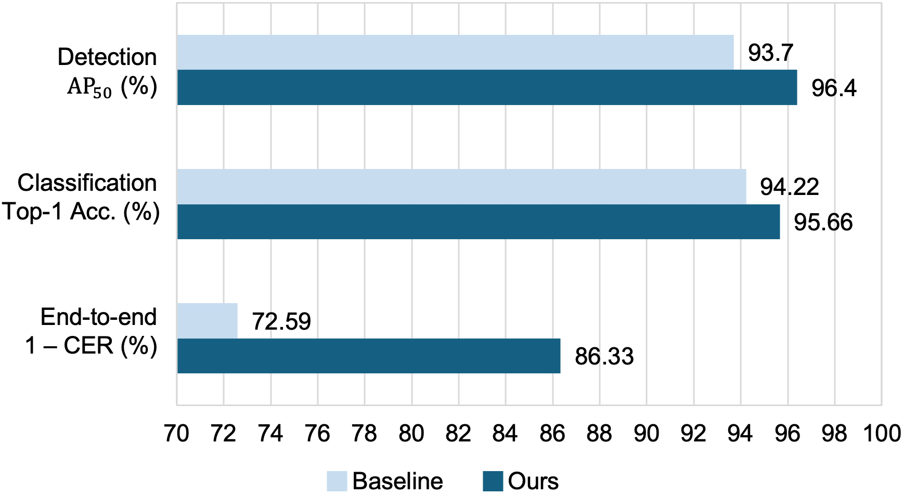
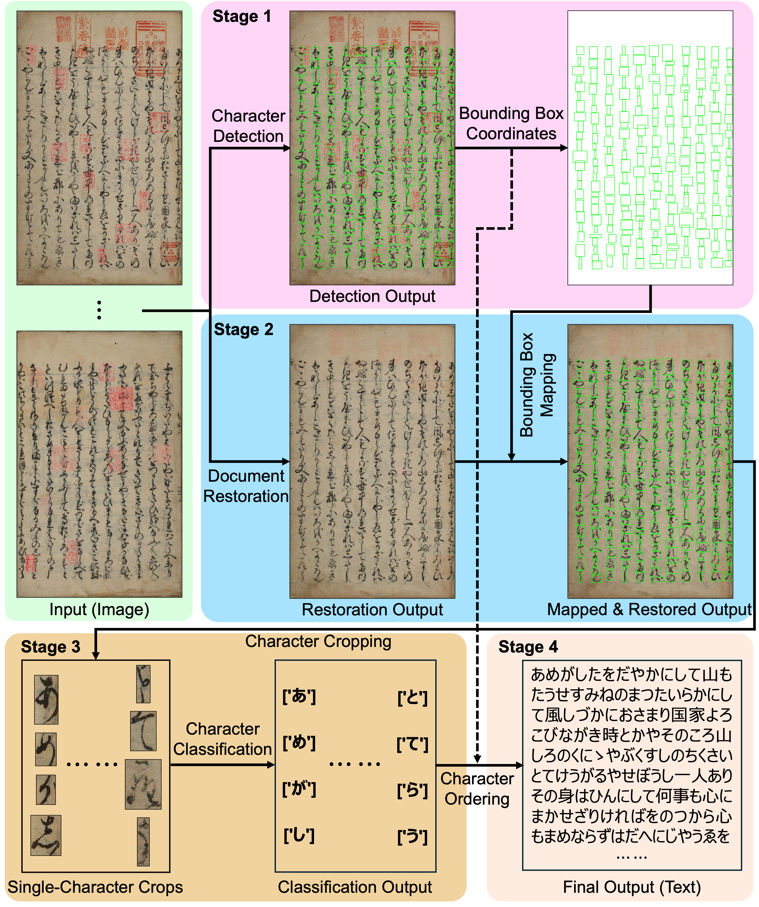
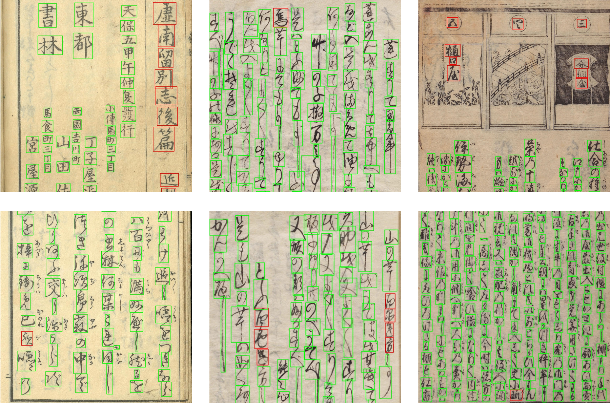
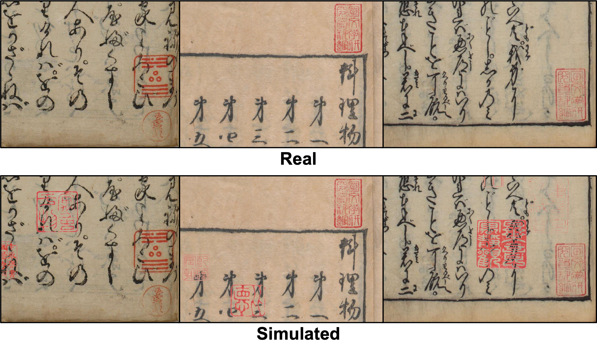
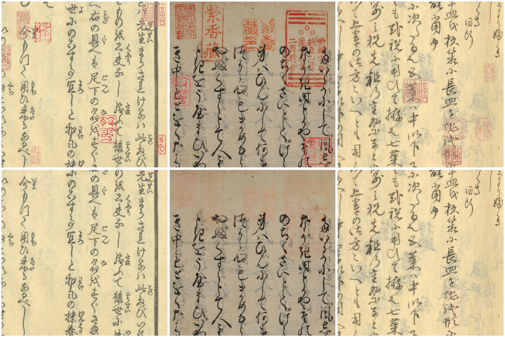
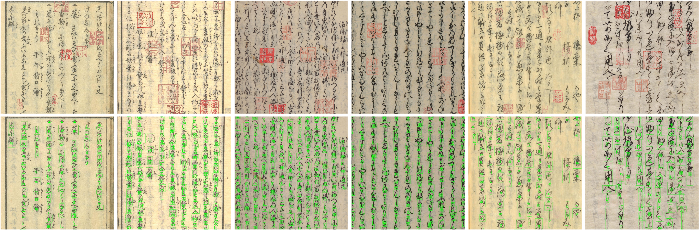

# Seal-Robust KCR
Seal-Robust KCR: A Robust Kuzushiji Character Recognition Framework under Seal Interference
>[arXiv](https://arxiv.org/abs/2602.19086)
>[Project](https://ruiyangju.github.io/RG-KCR/)

  <p align="left">
    
  </p>

* End-to-end Kuzushiji character recognition results comparison (i.e., from document image to text):

  | Method | CER @ Real Test | Speed (s/img) @ Real Test | CER @ Synth. Test | Speed (s/img) @ Synth. Test |
  |:--|:--:|:--:|:--:|:--:|
  | NDLkotenOCR-Lite | 21.76 | 2.494 | 47.82 | 3.225 |
  | NDLkotenOCR | 12.73 | 1.631 | 23.43 | 2.427 |
  | Baseline | 19.86 | **1.513** | 27.41 | **1.534** |
  | **Ours** | **11.98** | 2.002 | **13.67** | 2.662 |

# Pipeline
* Conventional pipeline (blue flow) and the proposed pipeline (red flow) for seal-interference Kuzushiji document images.
Dashed arrows indicate additional processes performed in parallel with character detection without affecting the detection results.

  <p align="left">
    
  </p>

# Citation
* If you find our paper useful in your research, please consider citing:
  ```
    @article{ju2026seal,
      title={Seal-Robust KCR: A Robust Kuzushiji Character Recognition Framework under Seal Interference},
      author={Ju, Rui-Yang and Yamashita, Kohei and Kameko, Hirotaka and Mori, Shinsuke},
      journal={arXiv preprint arXiv:2602.19086},
      year={2026}
    }
  ```

# Dataset
## ① Data Collection
* The original dataset is available from the [Center for Open Data in the Humanities (CODH)](https://codh.rois.ac.jp/char-shape/book/), and the raw data is held by [National Institute of Japanese Literature (NIJL)](https://www.nijl.ac.jp/db/).

    | Index | NIJL ID | Book Title | Pages | Characters | Chars/Page |
    | :--: | :--: | :--: | :--: | :--: | :--: |
    | 1 | 100241706 | Usonarubeshi (虚南留別志) | 67 | 8,565 | 127.8 |
    | 2 | 100249376 | Gozenkashi Hiden-shou (御前菓子秘伝抄) | 104 | 11,841 | 113.9 |
    | 3 | 100249416 | Mochigashi Sokuseki Teseishuu (餅菓子即席手製集) | 58 | 7,967 | 137.4 |
    | 4 | 100249476 | Meshi Hyakuchin Den (飯百珍伝) | 46 | 7,842 | 170.5 |
    | 5 | 200006663 | Diguchi (ぢぐち) | 8 | 121 | 15.1 |
    | 6 | 200015843 | Nippon Eitaigura (日本永代蔵) | 180 | 50,251 | 279.2 |
    | 7 | 200017458 | Soga Monogatari (曾我物語) | 78 | 29,641 | 380.0 |
    | 8 | 200020019 | Chikusai (竹斎) | 146 | 33,228 | 227.6 |
    | 9 | 200021086 | Isoho Monogatari (伊曾保物語) | 60 | 15,410 | 256.8 |
    | 10 | 200021763 | Zenbu Ryouri-shou (膳部料理抄) | 94 | 11,437 | 121.7 |
    | 11 | 200021802 | Ryouri Monogatari (料理物語) | 105 | 19,609 | 186.8 |
    | 12 | 200021869 | Ryourikata Kokoroenokoto (料理方心得之事) | 30 | 3,012 | 100.4 |
    | 13 | 200022050 | Ryouri Hiden-shou (料理秘伝抄) | 24 | 9,558 | 398.3 |
    | Total | N/A | N/A | 1,000 | 208,482 | 208.5 |

* Accordingly, we selected the **1,000** annotated images listed above as the benchmark dataset.

## ② Data Correction
* Among the **1,000** annotated images, we found that **267** images contained incomplete annotations.
* As shown below, the red bounding boxes are annotated by us, while the green bounding boxes are from the original annotations:
  <p align="left">
    
  </p>
* These missing labels were manually corrected, and the corresponding image names are listed below:

  <table>
  <tr>
  <td valign="top">
  <details>
  <summary>100241706 (5 images)</summary>
  <ul>
  <li>100241706_00002_1</li>
  <li>100241706_00006_1</li>
  <li>100241706_00016_1</li>
  <li>100241706_00033_1</li>
  <li>100241706_00038_1</li>
  </ul>
  </details>
  </td>
  
  <td valign="top">
  <details>
  <summary>100249376 (10 images)</summary>
  <ul>
  <li>100249376_00012_1</li>
  <li>100249376_00013_2</li>
  <li>100249376_00026_1</li>
  <li>100249376_00029_1</li>
  <li>100249376_00030_2</li>
  <li>100249376_00034_1</li>
  <li>100249376_00034_2</li>
  <li>100249376_00036_2</li>
  <li>100249376_00038_2</li>
  <li>100249376_00043_2</li>
  </ul>
  </details>
  </td>
  
  <td valign="top">
  <details>
  <summary>100249416 (9 images)</summary>
  <ul>
  <li>100249416_00002_2</li>
  <li>100249416_00003_2</li>
  <li>100249416_00004_1</li>
  <li>100249416_00004_2</li>
  <li>100249416_00006_1</li>
  <li>100249416_00014_1</li>
  <li>100249416_00014_2</li>
  <li>100249416_00017_1</li>
  <li>100249416_00018_1</li>
  </ul>
  </details>
  </td>
  </tr>
  
  
  <tr>
  <td valign="top">
  <details>
  <summary>100249476 (3 images)</summary>
  <ul>
  <li>100249476_00016_1</li>
  <li>100249476_00016_2</li>
  <li>100249476_00018_1</li>
  </ul>
  </details>
  </td>
  
  <td valign="top">
  <details>
  <summary>200015843 (65 images)</summary>
  <ul>
  <li>200015843_00002_2</li>
  <li>200015843_00003_1</li>
  <li>200015843_00004_2</li>
  <li>200015843_00011_1</li>
  <li>200015843_00016_1</li>
  <li>200015843_00016_2</li>
  <li>200015843_00018_1</li>
  <li>200015843_00019_1</li>
  <li>200015843_00024_2</li>
  <li>200015843_00025_1</li>
  <li>200015843_00028_2</li>
  <li>200015843_00029_2</li>
  <li>200015843_00030_1</li>
  <li>200015843_00034_2</li>
  <li>200015843_00035_1</li>
  <li>200015843_00037_1</li>
  <li>200015843_00037_2</li>
  <li>200015843_00041_2</li>
  <li>200015843_00047_2</li>
  <li>200015843_00048_1</li>
  <li>200015843_00049_1</li>
  <li>200015843_00049_2</li>
  <li>200015843_00051_2</li>
  <li>200015843_00054_1</li>
  <li>200015843_00055_1</li>
  <li>200015843_00056_1</li>
  <li>200015843_00058_1</li>
  <li>200015843_00058_2</li>
  <li>200015843_00060_2</li>
  <li>200015843_00062_1</li>
  <li>200015843_00062_2</li>
  <li>200015843_00063_1</li>
  <li>200015843_00063_2</li>
  <li>200015843_00069_2</li>
  <li>200015843_00070_1</li>
  <li>200015843_00071_1</li>
  <li>200015843_00079_2</li>
  <li>200015843_00086_1</li>
  <li>200015843_00088_1</li>
  <li>200015843_00088_2</li>
  <li>200015843_00092_2</li>
  <li>200015843_00093_1</li>
  <li>200015843_00094_1</li>
  <li>200015843_00096_2</li>
  <li>200015843_00097_1</li>
  <li>200015843_00097_2</li>
  <li>200015843_00098_1</li>
  <li>200015843_00099_2</li>
  <li>200015843_00100_2</li>
  <li>200015843_00104_1</li>
  <li>200015843_00104_2</li>
  <li>200015843_00110_2</li>
  <li>200015843_00112_1</li>
  <li>200015843_00115_2</li>
  <li>200015843_00116_1</li>
  <li>200015843_00116_2</li>
  <li>200015843_00117_1</li>
  <li>200015843_00120_2</li>
  <li>200015843_00126_1</li>
  <li>200015843_00127_2</li>
  <li>200015843_00128_1</li>
  <li>200015843_00129_1</li>
  <li>200015843_00129_2</li>
  <li>200015843_00130_2</li>
  <li>200015843_00132_1</li>
  </ul>
  </details>
  </td>
  
  <td valign="top">
  <details>
  <summary>200017458 (27 images)</summary>
  <ul>
  <li>200017458_00003_2</li>
  <li>200017458_00004_1</li>
  <li>200017458_00004_2</li>
  <li>200017458_00011_2</li>
  <li>200017458_00012_2</li>
  <li>200017458_00013_1</li>
  <li>200017458_00015_2</li>
  <li>200017458_00016_1</li>
  <li>200017458_00016_2</li>
  <li>200017458_00017_1</li>
  <li>200017458_00018_2</li>
  <li>200017458_00019_2</li>
  <li>200017458_00021_2</li>
  <li>200017458_00027_2</li>
  <li>200017458_00030_1</li>
  <li>200017458_00030_2</li>
  <li>200017458_00031_1</li>
  <li>200017458_00032_2</li>
  <li>200017458_00036_2</li>
  <li>200017458_00037_1</li>
  <li>200017458_00043_1</li>
  <li>200017458_00044_2</li>
  <li>200017458_00048_2</li>
  <li>200017458_00049_1</li>
  <li>200017458_00049_2</li>
  <li>200017458_00050_1</li>
  <li>200017458_00051_2</li>
  </ul>
  </details>
  </td>
  </tr>
  
  <tr>
  <td valign="top">
  <details>
  <summary>200020019 (48 images)</summary>
  <ul>
  <li>200020019_00003_1</li>
  <li>200020019_00006_1</li>
  <li>200020019_00008_2</li>
  <li>200020019_00009_1</li>
  <li>200020019_00011_1</li>
  <li>200020019_00012_1</li>
  <li>200020019_00013_1</li>
  <li>200020019_00014_1</li>
  <li>200020019_00014_2</li>
  <li>200020019_00015_1</li>
  <li>200020019_00017_2</li>
  <li>200020019_00018_1</li>
  <li>200020019_00018_2</li>
  <li>200020019_00019_1</li>
  <li>200020019_00020_1</li>
  <li>200020019_00023_1</li>
  <li>200020019_00026_1</li>
  <li>200020019_00028_2</li>
  <li>200020019_00031_1</li>
  <li>200020019_00032_2</li>
  <li>200020019_00033_2</li>
  <li>200020019_00037_2</li>
  <li>200020019_00038_1</li>
  <li>200020019_00038_2</li>
  <li>200020019_00040_1</li>
  <li>200020019_00041_2</li>
  <li>200020019_00043_1</li>
  <li>200020019_00043_2</li>
  <li>200020019_00046_1</li>
  <li>200020019_00046_2</li>
  <li>200020019_00048_2</li>
  <li>200020019_00049_1</li>
  <li>200020019_00049_2</li>
  <li>200020019_00057_1</li>
  <li>200020019_00058_2</li>
  <li>200020019_00059_1</li>
  <li>200020019_00060_1</li>
  <li>200020019_00062_1</li>
  <li>200020019_00063_1</li>
  <li>200020019_00064_1</li>
  <li>200020019_00067_1</li>
  <li>200020019_00070_1</li>
  <li>200020019_00071_1</li>
  <li>200020019_00071_2</li>
  <li>200020019_00072_1</li>
  <li>200020019_00073_2</li>
  <li>200020019_00075_2</li>
  <li>200020019_00079_2</li>
  </ul>
  </details>
  </td>
  
  <td valign="top">
  <details>
  <summary>200021086 (46 images)</summary>
  <ul>
  <li>200021086_00003_1</li>
  <li>200021086_00004_1</li>
  <li>200021086_00004_2</li>
  <li>200021086_00005_1</li>
  <li>200021086_00005_2</li>
  <li>200021086_00006_1</li>
  <li>200021086_00007_2</li>
  <li>200021086_00008_2</li>
  <li>200021086_00009_1</li>
  <li>200021086_00009_2</li>
  <li>200021086_00010_1</li>
  <li>200021086_00010_2</li>
  <li>200021086_00011_1</li>
  <li>200021086_00011_2</li>
  <li>200021086_00012_1</li>
  <li>200021086_00013_1</li>
  <li>200021086_00013_2</li>
  <li>200021086_00014_1</li>
  <li>200021086_00014_2</li>
  <li>200021086_00015_1</li>
  <li>200021086_00015_2</li>
  <li>200021086_00016_1</li>
  <li>200021086_00016_2</li>
  <li>200021086_00017_1</li>
  <li>200021086_00017_2</li>
  <li>200021086_00018_1</li>
  <li>200021086_00019_1</li>
  <li>200021086_00019_2</li>
  <li>200021086_00020_1</li>
  <li>200021086_00020_2</li>
  <li>200021086_00021_1</li>
  <li>200021086_00021_2</li>
  <li>200021086_00022_1</li>
  <li>200021086_00023_1</li>
  <li>200021086_00023_2</li>
  <li>200021086_00025_1</li>
  <li>200021086_00026_1</li>
  <li>200021086_00026_2</li>
  <li>200021086_00027_1</li>
  <li>200021086_00027_2</li>
  <li>200021086_00028_1</li>
  <li>200021086_00028_2</li>
  <li>200021086_00030_1</li>
  <li>200021086_00031_1</li>
  <li>200021086_00031_2</li>
  <li>200021086_00032_1</li>
  </ul>
  </details>
  </td>
  
  <td valign="top">
  <details>
  <summary>200021763 (22 images)</summary>
  <ul>
  <li>200021763_00014_2</li>
  <li>200021763_00017_1</li>
  <li>200021763_00019_2</li>
  <li>200021763_00020_1</li>
  <li>200021763_00020_2</li>
  <li>200021763_00021_1</li>
  <li>200021763_00022_2</li>
  <li>200021763_00023_1</li>
  <li>200021763_00023_2</li>
  <li>200021763_00026_2</li>
  <li>200021763_00030_1</li>
  <li>200021763_00032_2</li>
  <li>200021763_00035_1</li>
  <li>200021763_00035_2</li>
  <li>200021763_00036_1</li>
  <li>200021763_00036_2</li>
  <li>200021763_00038_2</li>
  <li>200021763_00039_2</li>
  <li>200021763_00040_1</li>
  <li>200021763_00041_1</li>
  <li>200021763_00043_2</li>
  <li>200021763_00047_2</li>
  </ul>
  </details>
  </td>
  </tr>
  
  <tr>
  <td valign="top">
  <details>
  <summary>200021802 (23 images)</summary>
  <ul>
  <li>200021802_00005_2</li>
  <li>200021802_00006_1</li>
  <li>200021802_00011_2</li>
  <li>200021802_00017_1</li>
  <li>200021802_00026_2</li>
  <li>200021802_00027_1</li>
  <li>200021802_00030_1</li>
  <li>200021802_00031_1</li>
  <li>200021802_00033_1</li>
  <li>200021802_00033_2</li>
  <li>200021802_00034_1</li>
  <li>200021802_00034_2</li>
  <li>200021802_00035_1</li>
  <li>200021802_00035_2</li>
  <li>200021802_00040_2</li>
  <li>200021802_00042_1</li>
  <li>200021802_00044_1</li>
  <li>200021802_00048_2</li>
  <li>200021802_00049_1</li>
  <li>200021802_00051_1</li>
  <li>200021802_00052_1</li>
  <li>200021802_00055_1</li>
  <li>200021802_00055_2</li>
  </ul>
  </details>
  </td>
  
  <td valign="top">
  <details>
  <summary>200021869 (3 images)</summary>
  <ul>
  <li>200021869_00004_2</li>
  <li>200021869_00008_2</li>
  <li>200021869_00014_1</li>
  </ul>
  </details>
  </td>
  
  <td valign="top">
  <details>
  <summary>200022050 (6 images)</summary>
  <ul>
  <li>200022050_00005_2</li>
  <li>200022050_00009_2</li>
  <li>200022050_00010_2</li>
  <li>200022050_00011_2</li>
  <li>200022050_00012_2</li>
  <li>200022050_00013_2</li>
  </ul>
  </details>
  </td>
  </tr>
  </table>

## ③ Data Splitting
* The **1,000** annotated images were randomly split into training, validation, and test sets with a ratio of **8:1:1**, consisting of **800** training images, **100** validation images, and **100** test images.
* You can download the **real dataset** (train + valid + test) [here](https://1drv.ms/f/c/56c255dd1bb9ae9e/IgCVAf1XRUZ4R4v6RequRDv7AaJMpwXhTEcaV4gz2CHa-y0?e=0wLcSC).

## ④ Synthetic Data Augmentation
* For the training set, **128** high-quality red seal images were used for synthetic data augmentation, thereby expanding the training set from **800** corrected images to **1,600** images.
* **Real** vs. **synthetic** seal-interfered documents:
  <p align="left">
    
  </p>
* You can download the **synthetic dataset** through synthetic data augmentation (train + valid + test) [here](https://1drv.ms/f/c/56c255dd1bb9ae9e/IgCkDlP7XG_rS6xpc1Kgbt_7Aaw8cbbKyWJLVW6dbljB69k).
* Notably, if you want to combine both the **real** and **synthetic** datasets for model training/validation/testing, please make sure that the image names across the two datasets are **different**.
* Therefore, the statistics of the dataset used in this work are summarized as follows:

    | Split | Real | Synthetic | Total | Seals/Page |
    | :---: | :---: | :---: | :---: | :---: |
    | Train | 800 | 800 | 1,600 | ≈10 |
    | Valid | 100 | 100 | 200 | ≈10 |
    | Test (Real) | 200 | N/A | 200 | 0-2 |
    | Test (Synth.) | N/A | 200 | 200 | ≈10 |

# Experiments
## Environment
  ```
    conda create -n sealrobustkcr python=3.10
    pip install -r requirements.txt
  ```

## ① Character Detection
* The character detection results are as follows:
  
    | Method | Params | FLOPs | Epoch | FPS | P<sup>Real</sup> | R<sup>Real</sup> | AP<sub>50</sub><sup>Real</sup> | AP<sub>50:95</sub><sup>Real</sup> | P<sup>Synth.</sup> | R<sup>Synth.</sup> | AP<sub>50</sub><sup>Synth.</sup> | AP<sub>50:95</sub><sup>Synth.</sup> |
    | :-- | :--: | :--: | :--: | :--: | :--: | :--: | :--: | :--: | :--: | :--: | :--: | :--: |
    | RT-DETR-R50 | 41.94M | 125.6G | 988 | 11.8 | 93.6% | 90.3% | 94.3% | 70.1% | 91.1% | 85.0% | 90.8% | 65.2% |
    | **+ SDA (Ours)** | 41.94M | 125.6G | 736 | 11.7 | 96.3% | 93.1% | 95.6% | 70.5% | 95.6% | 92.2% | 95.0% | 68.4% |
    | YOLOv9-C | 25.32M | 102.3G | 621 | 10.7 | 97.8% | 93.3% | 96.5% | 82.6% | 95.8% | 88.0% | 93.8% | 77.8% |
    | **+ SDA (Ours)** | 25.32M | 102.3G | 406 | 10.5 | 97.8% | 93.7% | 96.5% | 82.9% | 97.7% | 93.1% | 96.4% | 81.7% |
    | YOLOv10-L | 25.77M | 127.2G | 781 | 11.0 | 98.0% | 92.0% | 96.3% | 82.5% | 95.7% | 87.2% | 93.6% | 77.5% |
    | **+ SDA (Ours)** | 25.77M | 127.2G | 415 | 11.0 | 98.3% | 92.7% | 96.5% | 83.1% | 98.0% | 92.4% | 96.4% | 81.8% |
    | YOLO11-L | 25.28M | 86.6G | 549 | 10.5 | 97.9% | 92.9% | 96.4% | 83.0% | 95.8% | 87.7% | 93.7% | 78.1% |
    | **+ SDA (Ours)** | 25.28M | 86.6G | 440 | 10.5 | 98.0% | 93.5% | 96.5% | 83.3% | 97.6% | 93.1% | 96.4% | 82.1% |
    | YOLOv12-L | 26.39M | 82.1G | 909 | 10.5 | 97.4% | 93.4% | 96.4% | 82.7% | 95.5% | 87.7% | 93.7% | 77.6% |
    | **+ SDA (Ours)** | 26.39M | 82.1G | 408 | 10.4 | 97.5% | 93.6% | 96.5% | 83.2% | 97.5% | 92.8% | 96.3% | 81.9% |

### Train:
* Make ensure that the dataset is placed under `Seal-Robust-KCR/dataset` and organized as follows:

  ```
    Seal-Robust-KCR
    └── dataset
        ├── meta_raw.yaml
        ├── meta_aug.yaml
        ├── images
        │   ├── train
        │   │   ├── 100241706_00002_1.png
        │   │   └── ...
        │   ├── valid
        │   │   ├── 100241706_00005_2.png
        │   │   └── ...
        │   ├── test_raw
        │   │   ├── 100241706_00008_1.png
        │   │   └── ...
        │   └── test_aug
        │       ├── 100241706_00008_1.png
        │       └── ...
        └── labels
            ├── train
            │   ├── 100241706_00002_1.txt
            │   └── ...
            ├── valid
            │   ├── 100241706_00005_2.txt
            │   └── ...
            ├── test_raw
            │   ├── 100241706_00008_1.txt
            │   └── ...
            └── test_aug
                ├── 100241706_00008_1.txt
                └── ...
    ```

* Please update the dataset path (`/path/to/data`) in both `./dataset/meta_raw.yaml` and `./dataset/meta_aug.yaml` before training.

  ```
    path: '/path/to/data'
    train: 'images/train'
    val: 'images/valid'
    test: 'images/test' # 'images/test_raw' or 'images/test_aug'
    
    nc: 1
    names:
      0: Kuzushiji
  ```
* The difference between `meta_raw.yaml` and `meta_aug.yaml` is the test set: the former uses the **Real Test Set**, while the latter uses the **Synthetic Test Set**.
* You can train the models as follows:

  ```
    python train.py --model ./detection/ultralytics/cfg/models/v11/yolo11l.yaml --data ./dataset/meta_raw.yaml
  ```

### Pre-trained Model
* You can download our pre-trained models `YOLO11L.pt` and `YOLO11L_SDA.pt` [here](https://1drv.ms/f/c/56c255dd1bb9ae9e/IgAweMF9eV9jTLbzl0QRTO3qAZyziA9SlZ0Zjs9l5y1A3pI?e=cDmAwc).
* Put them in `./detection/models/`.

### Test on Real Test Set:
* You can test the model on real test set as follows:
  ```
    python test.py --model ./detection/models/YOLO11L_SDA.pt --data ./dataset/meta_raw.yaml
  ```

### Test on Synthetic Test Set:
* You can test the model on synthetic test set as follows:
  ```
    python test.py --model ./detection/models/YOLO11L_SDA.pt --data ./dataset/meta_aug.yaml
  ```
  
## ② Document Restoration
* The document restoration results are as follows:
  
  | τ<sub>r</sub> | (τ<sub>rg</sub>,τ<sub>rb</sub>) | PSNR<sub>Valid</sub> | SSIM<sub>Valid</sub> | PSNR<sub>Test</sub> | SSIM<sub>Test</sub> |
  | :--: | :--: | :--: | :--: | :--: | :--: |
  | -  | -   | 29.15dB | 0.9655 | 28.71dB | 0.9639 |
  | 80 | 1.2 | 29.76dB | 0.9470 | 29.61dB | 0.9465 |
  | 80 | 1.3 | 33.64dB | 0.9736 | 33.73dB | 0.9731 |
  | 80 | 1.4 | 33.87dB | 0.9756 | 33.77dB | 0.9745 |
  | 80 | 1.5 | 31.97dB | 0.9717 | 31.68dB | 0.9706 |
  | 90 | 1.2 | 30.37dB | 0.9522 | 30.19dB | 0.9519 |
  | 90 | 1.3 | 34.09dB | 0.9757 | 34.13dB | 0.9750 |
  | 90 | 1.4 | 34.05dB | 0.9763 | 33.94dB | 0.9753 |
  | 90 | 1.5 | 32.03dB | 0.9721 | 31.74dB | 0.9710 |

* Visual examples of document restoration results obtained with the parameters τ<sub>r</sub> = 90 and τ<sub>rg</sub> = τ<sub>rb</sub> = 1.3 are shown below:
  <p align="left">
    
  </p>

### Run
* You can run document restoration with `r_min = 90` and `rg_ratio = rb_ratio = 1.3` as follows:
  ```
    python ./restoration/run.py --input_dir ./dataset/images/test_aug --output_dir ./restoration/output --r_min 90 --rg_ratio 1.3 --rb_ratio 1.3
  ```

### Evaluate
* For the synthetic image, the ground truth is the corresponding real image.
* You can evaluate using `PSNR` and `SSIM` as follows:
  ```
    python ./restoration/evaluate.py --gt_dir ./dataset/images/test_raw --pred_dir ./restoration/output --output_csv ./restoration/output_csv
  ```

## ③ Character Cropping
* To extract individual Kuzushiji character instances, we crop each character region based on the predicted bounding boxes:
  ```
    python ./crop/run.py --image_dir ./restoration/output --labels_dir ./detection/runs/detect/test_YOLO11L_SDA/labels --save_root ./crop/output
  ```
* The output contains: **(1)** cropped images of individual Kuzushiji characters and **(2)** visualization results of the original images overlaid with the predicted bounding boxes.

## ④ Character Classification
* The character classification results are as follows:

  | Method | Top-1 Acc. | Top-5 Acc. | FPS |
  | :--: | :--: | :--: | :--: |
  | Baseline (Metom) | 94.22% | 97.64% | 1.81 |
  | + Rest. (Ours) | 95.66% | 98.62% | 1.14 |
  
* We use [Metom](https://codh.rois.ac.jp/char-shape/app/metom/) for character classification. The official source code is available on [Hugging Face](https://huggingface.co/SakanaAI/Metom).
* You can run character classification as follows:
  ```
    python ./classification/run.py --root_dir ./crop/output/crops --out_dir ./classification/output
  ```
* You can download the ground truth [here](https://1drv.ms/f/c/56c255dd1bb9ae9e/IgDDpS626Jn_RqpJcP7bLY2OARZmbqVZtbsxw1OqcD_Rhxw?e=eBhF2z). Please put the ground truth in `./classification/` and name the folder as `gt`.
  ```
    python ./classification/evaluate.py
  ```

## ⑤ Character Ordering
* We compare our proposed method with [LightGBM](https://github.com/lightgbm-org/LightGBM) on the character ordering task, and the results are shown below:
  
  | Method | Training | 1 − CER | FPS@i5-11600K |
  | :--: | :--: | :--: | :--: |
  | LightGBM | Yes | 78.75% | 15.38 |
  | Ours | No | 86.33 | 419.27 |


### Run
* You can run both methods as follows:
  ```
    python ordering_ours.py
    python ordering_lgbm.py
  ```

### Evaluate
* Before evaluation, you need download the test set ground-truth text from [here](https://1drv.ms/f/c/56c255dd1bb9ae9e/IgDiLBlaev4XQ46AdIStVkE2Ab97A9c0c9QBD5IabfERfuQ), and run as follows:
  ```
    python ordering_metric.py
  ```

## ⑥ Visualization
* After running `classification.py` to generate the `.json` file, you can visualize the prediction results by mapping them onto the restored document image using the following command:
  ```
    python visual.py --image path/to/restored_image.jpg --json /path/to/classification_results.json --out ./visutalization.jpg --font_size 64
  ```
  
  <p align="center">
    
  </p>
  
# License
  

This benchmark dataset is licensed under a [Creative Commons Attribution-ShareAlike 4.0 International License (CC BY-SA 4.0)](https://creativecommons.org/licenses/by-sa/4.0/).

### Original Kuzushiji Dataset

The original Kuzushiji dataset used in this work is based on **『日本古典籍くずし字データセット』** (National Institute of Japanese Literature / CODH), provided by [ROIS-DS Center for Open Data in the Humanities (CODH)](https://codh.rois.ac.jp/), which is licensed under a [Creative Commons Attribution-ShareAlike 4.0 International License (CC BY-SA 4.0)](https://creativecommons.org/licenses/by-sa/4.0/).

The following is the citation of the original Kuzushiji dataset; please cite it:
  ```
    『日本古典籍くずし字データセット』 （国文研所蔵／CODH加工） doi:10.20676/00000340
  ```
